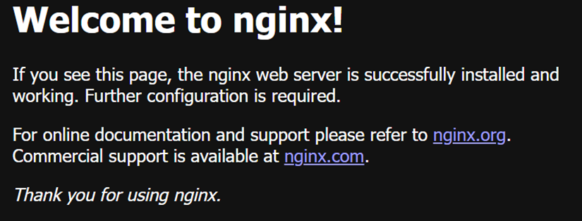

# TP Docker - Rendu

## Exercice 3 : Manipulation de base des conteneurs

### 1.Vérifiez la version de Docker :

```
docker --version
```

Résultat :
```
Docker version 29.1.3, build f52814d
```


### 2. Listez les images disponibles sur votre machine :

```
docker images
```

```
(Aucune image présente car on en a pas encore crée)
```

### 3. Téléchargez une image depuis Docker Hub :

```
docker pull hello-world
```

L'image est téléchargée depuis docker hub.

### 4. Exécutez un conteneur à partir de l'image :

```
docker run hello-world
```

```
Hello from Docker!

This message shows that your installation appears to be working correctly...
```

Le conteneur fonctionne donc bien.²

### 5. Listez les conteneurs en cours d'exécution :

```
docker ps
```

Aucun container ne s'affiche car le container précèdent s'est arrêté automatiquement.

### 6. Listez tous les conteneurs (actifs et stoppés) :

```
docker ps -a
```

Le container hello-world apparait cette fois ci.

### 7. Supprimez un conteneur :

```
docker rm fb3485a7e40e
```

Le container est supprimé.

### 8. Supprimez une image :

```
docker rmi d4aaab6242e0
```

L'image hello-world est supprimée.

## Exercice 4 : Création d'un serveur web avec Docker

### 1. Téléchargez l'image officielle Nginx :

```
docker pull nginx
```

### 2. Lancez un conteneur Nginx en arrière-plan :

```
docker run -d -p 8080:80 --name mon_nginx nginx
```


### 3. Vérifiez que le conteneur est actif :

```
docker ps
```

```
CONTAINER ID   IMAGE     COMMAND                  CREATED          STATUS          PORTS                                     NAMES
f34f0e05e5fd   nginx     "/docker-entrypoint.…"   35 seconds ago   Up 33 seconds   0.0.0.0:8080->80/tcp, [::]:8080->80/tcp   mon_nginx
```

Le container mon_nginx est en cours d'execution.

### 4. Accédez à la page dans votre navigateur pour voir la page par défaut de Nginx.



La page par défaut de Nginx est là, le container fonctionne donc bien.

### 5. Arrêtez le conteneur :

```
docker stop mon_nginx
```

### 6. Supprimez le conteneur :

```
docker rm mon_nginx
```

## Exercice 5 : Déploiement d'une application Python Flask

### Créez un fichier app.py contenant une application Flask minimale. (hello world)

On crée d'abord un fichier app.py qui contient une application Flask minimale.

```python
from flask import Flask

app = Flask(__name__)

@app.route("/")
def hello():
    return "Hello World !"

if __name__ == "__main__":
    app.run(host="0.0.0.0", port=8000)
```

On va faire une route /, ce qui veut dire que quand on va se connecter en localhost via un navigateur, on va directement tomber sur le message hello-world.

Le host="0.0.0.0" permet de pouvoir accéder à la route en dehors du container via un navigateur par exemple.

### Écrivez un Dockerfile pour construire l’image de l’application.

On crée ensuite un Dockerfile permettant de construire l'image docker de l'application Flask.

```dockerfile
FROM python:3.12-alpine

WORKDIR /app

COPY requirements.txt .
RUN pip install --no-cache-dir -r requirements.txt

COPY app.py .

EXPOSE 8000

CMD ["python", "app.py"]
```

A la première ligne, on, recupère une image Python, j'ai pris la version alpine pour que ce soit plus léger.

A la seconde ligne, on définit le répretoire de travail /app pour travailler ici dans l'image.

A la troisième ligne, on installe les dépendances python nécessaires pour faire fonctionner Flask.

A la quatrième ligne, on copie le fichier app.py dans le répertoire de travail de l'image (/app) pour être en mesure de l'utiliser dans l'image.

A la cinquième ligne, on expose le port 8000 car il est utilisé par Flask.

A la sixième ligne, on prépare la commande qui sera lancée au démarrage du container (python app.py).

### Contruction de l'image et lancement du container

```bash
docker build -t flask_image .
```

On crée une image que l'on nomme flask_image en utilisant l'option de tag -t. Celle-ci est construite à partir du Dockerfile.

```bash
docker run -p 8000:8000 --name test_flask flask_image
```

On vient ensuite lancer le container que l'on nomme test_flask avec l'option --name, en se basant sur la flask_image precedemment crée. On mappe la port 8000 utilisée dans le container avec le port 8000 de notre machine pour pouvoir accéder à l'appli depuis notre machine.

### Tester l'application depuis le navigateur

```
http://127.0.0.1:8000
```

Le message Hello World ! s'affiche dans notre navigateur quand on rentre le lien ce qui prouve que l'application fonctionne bien.

## Exercice 6 : Utilisation de docker compose

### Compléter votre fichier app.py afin de lui ajouter une connexion a un bdd mongoDB

Il y a quelques modifications du fichier app.py permettant de lui ajouter une connexion MongoDB.

```python
from flask import Flask
from pymongo import MongoClient

app = Flask(__name__)

client = MongoClient("mongodb://mongo:27017/")
db = client.testdb
collections = db.users

@app.route("/")
def hello():
    return f"Connexion MongoDB OK. Collections : {collections}"

if __name__ == "__main__":
    app.run(host="0.0.0.0", port=8000)
```

On importe maintenant MongoDB en utilisant la bibliothèque pymongo. On se connecte avec la base de données qui sera crée sur le container et on extrait dans la base de données de test présentes à l'interieur, les noms des utilisateurs de tests. On les affichera ensuite dans l'application pour montrer que la bd marche bien et le container avec.

### Création du fichier docker compose avec 2 container

Le fichier docker compose permet de mettre plusieurs containers dans une image et de tous les lancer. 

```yaml
version : "3"
services:
  app:
    build : .
    ports:
      - 8000:8000
    depends_on:
      - mongo
  mongo:
    image: mongo:7
    ports:
      - "27017:27017"
```

On se mets en version 3  de docker compose car c'est celle-ci qui est toujours utilisée de nos jours.

On vient aussi créer 2 services qui correspondent aux 2 containers : app et mongo. 

Le service app correspond est construit à partir du Dockerfile. Il sera accessible sur le port 8000 du container sur le port 8000 de notre ordinateur, ça correspond à la commande run qu'on faisait avant. IL dépend aussi du service mongo car celui-ci doit être crée avant pour que l'applciation flask puisse marcher.

Le service mongo se base sur une image mongo et expose le port 27017 du container sur le port 27017 de notre ordinateur pour pouvoir permettre à l'appli flask de s'y connecter.

### Lancer le docker compose et vérifier la connexion à la base de données

```bash
docker compose up --build
```

On lance le docker compose qui va prendre le fichier docker-compose.yaml du répertoire courant et le lancer, ce qui va construire notre image et lancer les 2 services à l'intérieur.

```
http://127.0.0.1:8000
```

On accéde ensuite à notre application depuis notre navigateur et on voit s'afficher le message indiquant qu'elle fonctionne bien.
